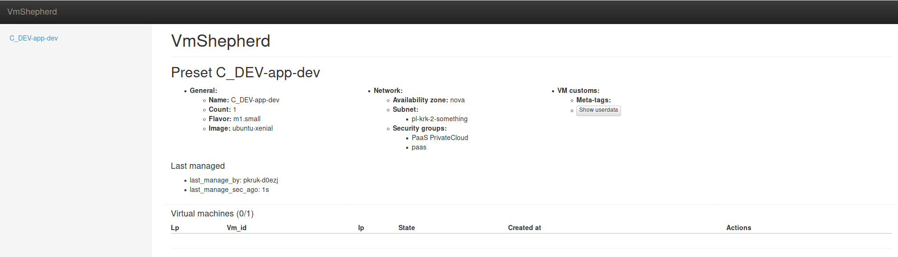

===============
Panel
===============

Description
-----------

VmShepherd provides a User Friendly webpanel available at the `/` handler, where you can easily administrate your environment.

Pages
-----

* Home Page (/)
    * Header ( Vmshepherd name )
    * Left Panel is a navigation a list of presets
    * Dashboard shows a list of presets, where every preset contains:
        * Name: Preset Name
        * Basic preset information like:
            * General: Basic info like Preset name, Preset size, VMs flavor, VMs system images
            * Network: Availability zone, Subnet and security groups
            * VM customs: Is a custom information which you can provide to preset (for example SaltStack grains)
            * Show userdata: Commands used after system installation on VM
        * Last managed: shows last changes in a preset
        * Virtual machines: list of virtual machines in a preset

Screenshots
-----------

Home Page
.........

Development
-----------

Our UI code is available here in the ``vmshepherd.http`` module. In this module you will also find our css styles and UI configurations.

Homepage (Panel /)
..................

.. automodule:: vmshepherd.http.__init__
    :members:
    :undoc-members:
    :show-inheritance:

